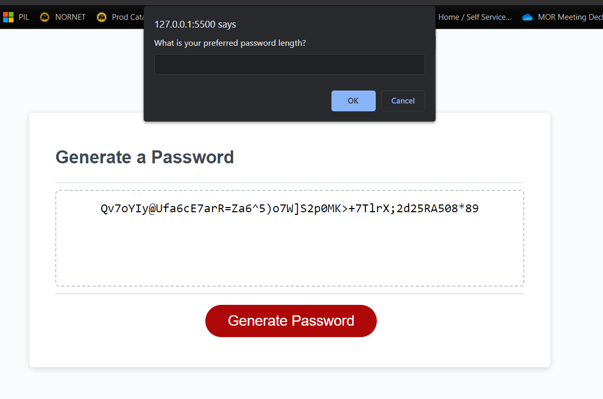

# Password Generator Randomizer

## <strong>Description</strong>

For Module 3, we were given the task of creating a piece of code that allows the user to generate a random password with specific criteria the user would select.

## <strong>Acceptance Criteria</strong>

♦ Generate prompts asking which criteria the user would like to use in the random password generator

♦ Ensure the password is the length specified in the assignment

♦ Ask the user what character types would be preferred in the randomly generated password

♦ When all prompts are answered, a randomized password is generated based on the users responses

## <strong>Criteria Met</strong>

♦ Program asks all corresponding criteria asked of it in the acceptance criteria

♦ Password generates on screen with given variables approved of by user

### <strong>Website Link</strong>

https://github.com/FleischmanJ88/03-RNG-Machine

### <strong>Screenshot</strong>

### <strong>Contact Information</strong>

https://github.com/FleischmanJ88